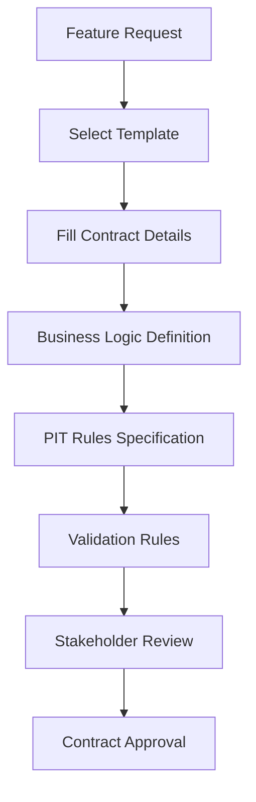
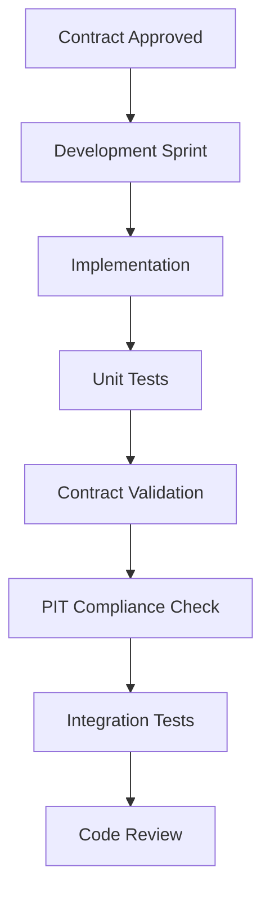
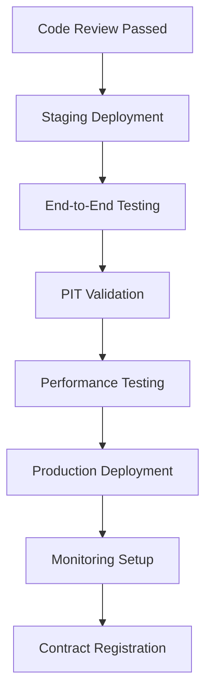
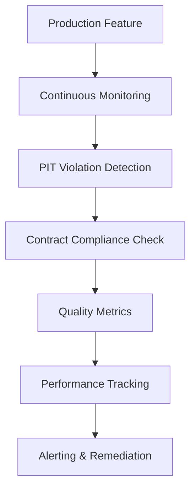

# Feature Governance Framework

## Overview

The Feature Governance Framework ensures institutional-grade feature management with comprehensive point-in-time (PIT) guarantees, contract validation, and temporal data integrity across the trading platform.

## 🎯 Objectives

- **Point-in-Time Integrity**: Guarantee no future information leakage in feature calculations
- **Contract Compliance**: Enforce feature contracts with automated validation
- **Temporal Consistency**: Normalize timestamps to UTC with millisecond precision
- **Data Quality**: Maintain high-quality feature data with comprehensive monitoring
- **Governance Workflows**: Standardized processes for feature development and deployment

## 🏗️ Architecture

### Core Components

1. **Feature Contract Templates** (`docs/feature-contracts/templates/`)
   - Technical indicators (RSI, MACD, moving averages)
   - Fundamental data (earnings, ratios, financial statements)
   - Sentiment analysis (social media, news sentiment)
   - Macroeconomic indicators (rates, inflation, GDP)
   - Options-derived features (implied volatility, Greeks)
   - Event-driven features (earnings, splits, announcements)

2. **Contract Validator** (`tools/feature_contract_validator.py`)
   - Comprehensive schema validation
   - Business rule enforcement
   - CI/CD integration
   - Automated reporting

3. **PIT Enforcement Pipeline** (`tools/pit_enforcement_pipeline.py`)
   - Real-time violation detection
   - Timestamp normalization
   - Cross-service validation
   - Automated remediation

4. **Temporal Feature Store** (`services/analysis-service/app/services/temporal_feature_store.py`)
   - Production-grade feature storage
   - Point-in-time lookups
   - Contract validation
   - Temporal tables with TimescaleDB

## 📋 Feature Contract Lifecycle

### 1. Feature Definition Phase



**Required Artifacts:**
- Feature contract YAML file
- Business justification document
- PIT compliance verification
- Data dependency mapping

### 2. Development Phase



**Automated Checks:**
- Contract validation in CI/CD
- PIT enforcement testing
- Data quality validation
- Performance benchmarking

### 3. Deployment Phase



**Deployment Gates:**
- All PIT validations pass
- Feature contracts validate
- Performance benchmarks met
- Monitoring configured

### 4. Operations Phase



**Ongoing Activities:**
- 24/7 PIT monitoring
- Contract compliance tracking
- Quality score monitoring
- Performance optimization

## 🔧 Tools and Scripts

### Feature Contract Validator

```bash
# Validate single contract
python tools/feature_contract_validator.py validate contract.yml

# Validate all contracts
python tools/feature_contract_validator.py validate-all docs/feature-contracts/

# Generate comprehensive report
python tools/feature_contract_validator.py generate-report docs/feature-contracts/ --output report.json

# Create CI integration script
python tools/feature_contract_validator.py create-ci-script
```

### PIT Enforcement Pipeline

```bash
# Real-time monitoring (60 minutes)
python tools/pit_enforcement_pipeline.py monitor --duration 60

# Validate specific service
python tools/pit_enforcement_pipeline.py validate-timestamps --service market-data

# Normalize event timestamps
python tools/pit_enforcement_pipeline.py normalize-events --source events.json

# Generate PIT report
python tools/pit_enforcement_pipeline.py generate-report --output pit_report.json
```

## 📊 Monitoring and Alerting

### Key Metrics

1. **PIT Compliance Score**
   - Percentage of features without violations
   - Target: 100% compliance
   - Alert threshold: <99%

2. **Contract Validation Rate**
   - Percentage of contracts passing validation
   - Target: 100% pass rate
   - Alert threshold: <100%

3. **Timestamp Quality Score**
   - Accuracy of timestamp normalization
   - Target: >99% confidence
   - Alert threshold: <95%

4. **Feature Availability**
   - Uptime of feature calculation services
   - Target: >99.9% availability
   - Alert threshold: <99%

### Alert Categories

- **Critical**: Future information leakage detected
- **High**: Contract violations, SLA breaches
- **Medium**: Quality score degradation, performance issues
- **Low**: Configuration warnings, maintenance notices

## 🔒 Security and Compliance

### Data Privacy

- PII classification for all features
- Anonymization requirements for sentiment data
- GDPR compliance for European markets
- Data retention policies

### Regulatory Compliance

- MiFID II transaction reporting
- GDPR data protection requirements
- SOX financial reporting controls
- Basel III risk management standards

### Audit Trail

- Complete feature lineage tracking
- Contract change history
- PIT violation records
- Data quality audit logs

## 🚀 Getting Started

### For Feature Developers

1. **Select Template**: Choose appropriate feature type template
2. **Define Contract**: Fill out all required fields
3. **Implement Feature**: Follow PIT guidelines
4. **Validate Locally**: Run contract validator
5. **Submit PR**: Automated validation in CI/CD

### For Data Scientists

1. **Review Available Features**: Check feature registry
2. **Understand Contracts**: Read feature documentation
3. **Access Features**: Use temporal feature store API
4. **Monitor Quality**: Track feature performance
5. **Report Issues**: Use governance workflow

### For Platform Engineers

1. **Deploy Infrastructure**: Set up temporal tables
2. **Configure Monitoring**: Install PIT enforcement
3. **Set Up Alerts**: Configure notification channels
4. **Maintain Services**: Regular health checks
5. **Optimize Performance**: Continuous improvement

## 📖 Reference Documentation

### Templates

- [Technical Feature Template](templates/technical_feature_template.yml)
- [Fundamental Feature Template](templates/fundamental_feature_template.yml)
- [Sentiment Feature Template](templates/sentiment_feature_template.yml)
- [Macro Feature Template](templates/macro_feature_template.yml)
- [Options Feature Template](templates/options_feature_template.yml)
- [Event Feature Template](templates/event_feature_template.yml)

### Workflows

- [Feature Development Workflow](workflows/development_workflow.md)
- [Contract Review Process](workflows/contract_review.md)
- [PIT Violation Response](workflows/pit_violation_response.md)
- [Quality Assurance Process](workflows/quality_assurance.md)

### API Documentation

- [Temporal Feature Store API](../services/analysis-service/docs/temporal_features_api.md)
- [Contract Validator API](../tools/docs/validator_api.md)
- [PIT Enforcement API](../tools/docs/pit_enforcement_api.md)

## 🤝 Contributing

### Feature Contract Contributions

1. Fork the repository
2. Create feature branch: `git checkout -b feature/new-contract`
3. Add/modify contracts in `docs/feature-contracts/`
4. Validate contracts: `python tools/feature_contract_validator.py validate-all`
5. Run PIT checks: `python tools/pit_enforcement_pipeline.py validate-timestamps`
6. Submit pull request

### Governance Process Improvements

1. Document the improvement need
2. Discuss in governance working group
3. Create RFC (Request for Comments)
4. Implement changes with backward compatibility
5. Update documentation and training materials

## 📞 Support

### Escalation Path

1. **Level 1**: Development team lead
2. **Level 2**: Data platform team
3. **Level 3**: Chief Technology Officer
4. **Level 4**: Risk management committee

### Communication Channels

- **Slack**: #trading-platform-governance
- **Email**: trading-governance@company.com
- **Emergency**: PagerDuty integration
- **Documentation**: Confluence space

## 📈 Roadmap

### Phase 3A: Current (Weeks 1-2)
- ✅ Feature contract templates
- ✅ Contract validator with CI integration
- ✅ PIT enforcement pipeline
- ✅ Temporal feature store
- ✅ Governance documentation

### Phase 3B: Next (Weeks 3-4)
- [ ] Real-time monitoring dashboard
- [ ] Advanced analytics on feature usage
- [ ] ML-based anomaly detection for PIT violations
- [ ] Self-healing feature pipelines

### Phase 3C: Future (Weeks 5-8)
- [ ] Cross-asset feature standardization
- [ ] Regulatory reporting automation
- [ ] Advanced feature versioning
- [ ] Global feature marketplace

---

**Last Updated**: September 30, 2025  
**Version**: 1.0.0  
**Maintainer**: Trading Platform Governance Team