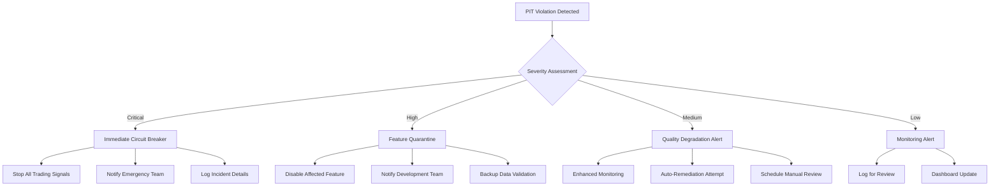

# Point-in-Time (PIT) Violation Response Workflow

## Overview

This document outlines the standardized response procedures for handling point-in-time violations in the trading platform. PIT violations are critical incidents that can compromise trading integrity and must be addressed immediately.

## 🚨 Violation Severity Levels

### Critical Violations (P0)
- **Future Information Leakage**: Feature uses data from the future
- **Trading Decision Impact**: Violation affects live trading decisions
- **Regulatory Violation**: Breach of compliance requirements
- **Response Time**: Immediate (0-5 minutes)

### High Violations (P1)
- **Historical Data Corruption**: Improper revision of historical data
- **Contract Violation**: Severe breach of feature contract terms
- **Data Pipeline Failure**: Systematic failure in data processing
- **Response Time**: 5-15 minutes

### Medium Violations (P2)
- **Timestamp Drift**: Inconsistent timestamp normalization
- **Arrival Delay**: Data arriving outside expected latency window
- **Quality Degradation**: Significant drop in data quality scores
- **Response Time**: 15-60 minutes

### Low Violations (P3)
- **Configuration Warning**: Minor configuration inconsistencies
- **Documentation Gap**: Missing or outdated documentation
- **Monitoring Alert**: Non-critical monitoring threshold breaches
- **Response Time**: 1-24 hours

## 🔧 Automated Response System

### Immediate Automated Actions (0-30 seconds)



### Circuit Breaker Logic

```python
class PITCircuitBreaker:
    def __init__(self):
        self.violation_threshold = {
            'critical': 1,      # Any critical violation triggers breaker
            'high': 3,          # 3 high violations in 5 minutes
            'medium': 10,       # 10 medium violations in 15 minutes
            'low': 50           # 50 low violations in 1 hour
        }
        self.time_windows = {
            'critical': 0,      # Immediate
            'high': 300,        # 5 minutes
            'medium': 900,      # 15 minutes
            'low': 3600         # 1 hour
        }
    
    def should_trigger_breaker(self, violations: List[PITViolation]) -> bool:
        """Determine if circuit breaker should be triggered."""
        current_time = datetime.now(timezone.utc)
        
        for severity, threshold in self.violation_threshold.items():
            window = self.time_windows[severity]
            
            # Count violations in time window
            recent_violations = [
                v for v in violations 
                if v.severity == severity 
                and (current_time - v.detected_at).total_seconds() <= window
            ]
            
            if len(recent_violations) >= threshold:
                return True, severity, len(recent_violations)
        
        return False, None, 0
```

## 👥 Response Team Structure

### Emergency Response Team (Critical/High Violations)
- **Incident Commander**: Senior Engineering Manager
- **Technical Lead**: Principal Engineer (Data Platform)
- **Domain Expert**: Feature Owner/Quantitative Researcher
- **Communications Lead**: DevOps Manager
- **Risk Assessment**: Risk Management Representative

### Standard Response Team (Medium/Low Violations)
- **Primary Engineer**: Feature Owner
- **Data Engineer**: Data Platform Team Member
- **QA Engineer**: Quality Assurance Representative
- **Documentation Lead**: Technical Writer

## 📞 Escalation Matrix

### Critical Violations (P0)

| Time | Action | Responsible |
|------|--------|-------------|
| 0-1 min | Automated circuit breaker activation | System |
| 1-2 min | Emergency team pager notification | PagerDuty |
| 2-5 min | Incident commander assignment | On-call manager |
| 5-10 min | Executive notification (CTO, CRO) | Incident commander |
| 10-15 min | Regulatory notification preparation | Legal team |
| 15-30 min | Customer communication preparation | Customer success |
| 30+ min | Public disclosure preparation (if required) | Communications |

### High Violations (P1)

| Time | Action | Responsible |
|------|--------|-------------|
| 0-5 min | Feature quarantine activation | System |
| 5-10 min | Development team notification | Slack/Email |
| 10-15 min | Technical lead assignment | Engineering manager |
| 15-30 min | Root cause analysis initiation | Technical lead |
| 30-60 min | Remediation plan development | Response team |
| 1-4 hours | Implementation and testing | Engineering team |

## 🔍 Investigation Procedures

### 1. Immediate Assessment (First 5 minutes)

```bash
# Quick diagnostic commands
# Check system status
python tools/pit_enforcement_pipeline.py generate-report --output emergency_report.json

# Check recent violations
psql -c "SELECT * FROM pit_violations WHERE detected_at >= NOW() - INTERVAL '1 hour' ORDER BY detected_at DESC LIMIT 20;"

# Check affected services
curl -s http://localhost:8001/health | jq '.pit_compliance'
curl -s http://localhost:8003/health | jq '.pit_compliance'
curl -s http://localhost:8004/health | jq '.pit_compliance'

# Check feature status
python tools/feature_contract_validator.py validate-all docs/feature-contracts/
```

### 2. Detailed Investigation (First 30 minutes)

#### Data Collection
- Complete violation details and metadata
- Feature calculation history and dependencies
- Data pipeline logs and processing times
- System performance metrics
- User activity logs

#### Root Cause Analysis
```sql
-- Investigate violation patterns
SELECT 
    service_name,
    violation_type,
    COUNT(*) as violation_count,
    MIN(detected_at) as first_occurrence,
    MAX(detected_at) as last_occurrence,
    AVG(EXTRACT(EPOCH FROM (as_of_timestamp - timestamp))) as avg_time_diff
FROM pit_violations 
WHERE detected_at >= NOW() - INTERVAL '24 hours'
GROUP BY service_name, violation_type
ORDER BY violation_count DESC;

-- Check for systematic issues
SELECT 
    feature_name,
    COUNT(*) as violations,
    string_agg(DISTINCT violation_type, ', ') as violation_types,
    string_agg(DISTINCT description, '; ') as descriptions
FROM pit_violations 
WHERE detected_at >= NOW() - INTERVAL '1 hour'
GROUP BY feature_name
HAVING COUNT(*) > 1;
```

### 3. Impact Assessment

#### Trading Impact Analysis
- Identify affected trading strategies
- Calculate potential financial impact
- Assess regulatory reporting implications
- Determine customer communication needs

#### Technical Impact Analysis
- Evaluate system stability
- Check data integrity
- Assess feature availability
- Review monitoring coverage

## 🛠️ Remediation Procedures

### Critical Violation Remediation

#### Step 1: Immediate Containment
```bash
# Emergency feature shutdown
curl -X POST http://localhost:8003/features/emergency-disable \
  -H "Content-Type: application/json" \
  -d '{"feature_name": "affected_feature", "reason": "PIT_VIOLATION"}'

# Isolate affected data
psql -c "UPDATE feature_data SET status = 'QUARANTINED' WHERE feature_name = 'affected_feature' AND timestamp >= 'violation_start_time';"

# Stop all dependent calculations
python tools/feature_dependency_manager.py disable-cascade --feature affected_feature
```

#### Step 2: Data Verification
```bash
# Verify data integrity
python tools/data_integrity_checker.py --feature affected_feature --start-time violation_start

# Cross-validate with external sources
python tools/external_data_validator.py --feature affected_feature

# Generate integrity report
python tools/pit_enforcement_pipeline.py validate-timestamps --service affected_service
```

#### Step 3: Safe Restoration
```bash
# Restore from clean backup
python tools/data_restore.py --feature affected_feature --restore-point pre_violation_checkpoint

# Validate restoration
python tools/feature_contract_validator.py validate docs/feature-contracts/affected_feature.yml

# Gradual re-enablement
curl -X POST http://localhost:8003/features/gradual-enable \
  -H "Content-Type: application/json" \
  -d '{"feature_name": "affected_feature", "traffic_percentage": 10}'
```

### High Violation Remediation

#### Step 1: Feature Quarantine
- Disable feature for new calculations
- Preserve existing data for analysis
- Implement temporary workarounds if needed

#### Step 2: Code Review and Fix
- Identify root cause in feature implementation
- Develop and test fix
- Update feature contract if necessary
- Implement additional safeguards

#### Step 3: Validation and Deployment
- Comprehensive testing in staging environment
- PIT compliance verification
- Gradual rollout with monitoring
- Performance validation

## 📊 Monitoring and Alerting

### Real-time Dashboards

#### Executive Dashboard
- Total violations by severity
- System-wide PIT compliance status
- Financial impact estimates
- Regulatory compliance status

#### Technical Dashboard
- Violation trends by service
- Feature availability status
- Data quality metrics
- Response time metrics

#### Operational Dashboard
- Active incidents and status
- Team assignment and workload
- Resolution time tracking
- Escalation status

### Alert Configurations

```yaml
# PagerDuty Integration
critical_violations:
  trigger: "any critical PIT violation"
  notify: "emergency-response-team"
  escalation: "5 minutes to executives"

high_violations:
  trigger: "3+ high violations in 5 minutes"
  notify: "engineering-team"
  escalation: "15 minutes to management"

violation_trends:
  trigger: "50% increase in violations over 1 hour"
  notify: "data-platform-team"
  escalation: "30 minutes to engineering-management"
```

## 📝 Documentation and Communication

### Incident Reports

#### Required Information
- Violation details and classification
- Timeline of events and responses
- Root cause analysis
- Impact assessment
- Remediation steps taken
- Lessons learned
- Prevention measures

#### Template
```markdown
# PIT Violation Incident Report

## Incident Summary
- **Incident ID**: PIT-2024-001
- **Severity**: Critical/High/Medium/Low
- **Detection Time**: [timestamp]
- **Resolution Time**: [timestamp]
- **Duration**: [time to resolution]

## Impact Assessment
- **Affected Features**: [list]
- **Affected Services**: [list]
- **Trading Impact**: [description]
- **Financial Impact**: [estimate]
- **Regulatory Impact**: [assessment]

## Root Cause Analysis
- **Primary Cause**: [description]
- **Contributing Factors**: [list]
- **Systemic Issues**: [analysis]

## Response Actions
- **Immediate Actions**: [list]
- **Remediation Steps**: [list]
- **Validation Performed**: [list]

## Lessons Learned
- **What Went Well**: [analysis]
- **What Could Be Improved**: [analysis]
- **Action Items**: [list with owners and due dates]

## Prevention Measures
- **Code Changes**: [description]
- **Process Improvements**: [description]
- **Monitoring Enhancements**: [description]
- **Training Requirements**: [description]
```

### Stakeholder Communication

#### Internal Communication
- Engineering team: Technical details and remediation steps
- Management: Business impact and timeline
- Risk team: Compliance implications
- Customer success: Customer impact assessment

#### External Communication (if required)
- Regulatory bodies: Compliance breach notification
- Customers: Service impact notification
- Partners: Integration impact assessment

## 🔄 Continuous Improvement

### Post-Incident Review Process

#### Immediate Review (Within 24 hours)
- Incident timeline reconstruction
- Response effectiveness assessment
- Immediate improvements identification
- Communication effectiveness review

#### Detailed Review (Within 1 week)
- Comprehensive root cause analysis
- Process improvement recommendations
- Technology enhancement proposals
- Training need assessment

#### Quarterly Review
- Violation trend analysis
- Response time improvement tracking
- Prevention measure effectiveness
- Team performance assessment

### Metrics and KPIs

#### Response Effectiveness
- Mean time to detection (MTTD)
- Mean time to response (MTTR)
- Mean time to resolution (MTTR)
- Escalation accuracy rate

#### Prevention Effectiveness
- Violation recurrence rate
- False positive rate
- System availability impact
- Customer satisfaction scores

#### Process Improvement
- Response team training completion
- Process adherence rate
- Documentation quality scores
- Stakeholder feedback ratings

---

**Document Owner**: Incident Response Team  
**Last Review**: September 30, 2025  
**Next Review**: December 30, 2025  
**Emergency Contact**: +1-555-EMERGENCY